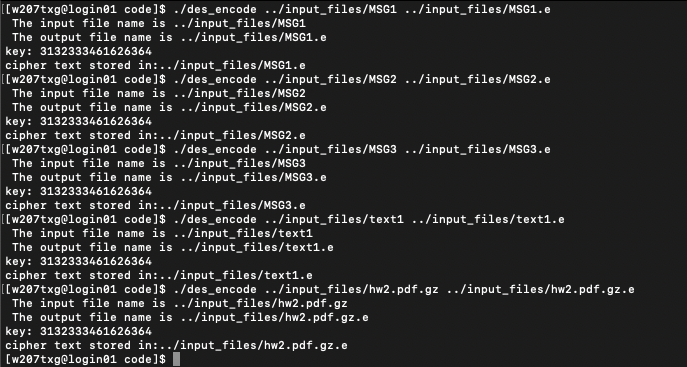
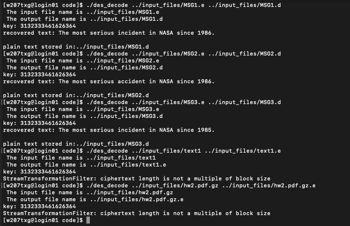
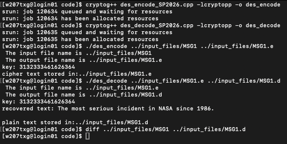

# Project 1 - Information Security

## Task 1: Compile

#### Encoding

#### decoding

### Sub-task 1: Print encrypted file
  

### Sub-task 2: Comparing

### Sub-task 3: Using `diff`

## Task 2: Edit and Verify

