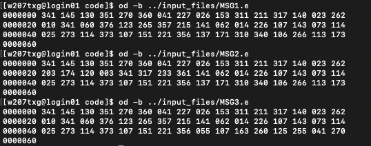
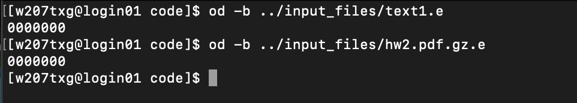
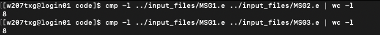
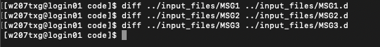

# Project 1 - Information Security

## Task 1: Compile

### Sub-task 1: Print encrypted file

   
   

   
   

### Sub-task 2: Comparing

   
   

### Sub-task 3: Using `diff`

   
   

## Task 2: Edit and Verify

